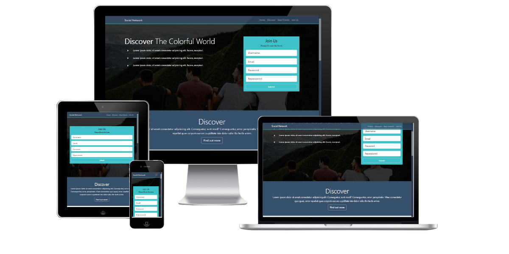

# Project – Social Network 
This is a small exercise with Bootstrap 5. Through this small project, I have strengthened my knowledge in Bootstrap 5.

## Table of contents

- [Overview](#overview)
  - [Screenshot](#screenshot)
  - [Links](#links)
- [My process](#my-process)
  - [Built with](#built-with)
  - [Frameworks](#frameworks)
  - [Tools](#tools)
  - [What I learned](#what-i-learned)
- [Author](#author)

## Overview

### Screenshot

### Links

- Solution URL: [Github Solutions](https://github.com/Adem-Tozlu/Projekt-Social-Network)
- Live Site URL: [Website Shop](https://projekt-social-network.vercel.app)

## My process

### Built with

- Semantic HTML5 markup
- SASS/SCSS
- Mobile-design
- Bootstrap

## Frameworks
 - React

## Tools
 - Vite

### What I learned

By developing this small project, I expanded my knowledge and skills in Bootstrap.

## Author

- Website - [Github](https://github.com/Adem-Tozlu)
- Frontend Mentor – [@Adem-Tozlu](https://www.frontendmentor.io/profile/Adem-Tozlu)
- Linkedin - [@Adem-Tozlu](https://www.linkedin.com/in/adem-tozlu)